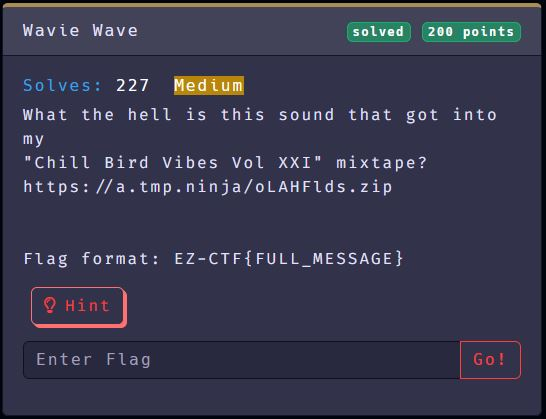
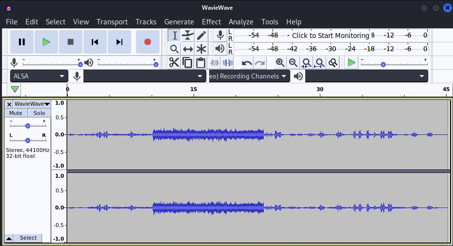
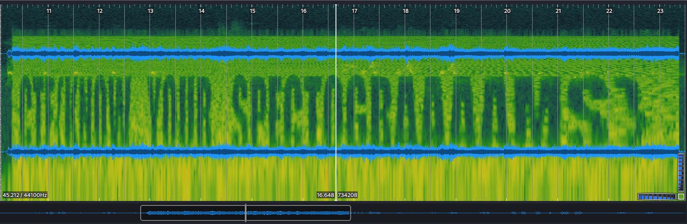

# Wavie Wave
### EZ CTF INC 2022
### Official URL: https://ez.ctf.cafe/
---
### In Misc Category:
### Name: Wavie Wave
### Solves: 227  
### Difficulty: Medium

What the hell is this sound that got into my
"Chill Bird Vibes Vol XXI" mixtape?
https://a.tmp.ninja/oLAHFlds.zip

Hint: Especto Patronum

Flag format: EZ-CTF{FULL_MESSAGE}

---

The link downloads a zip file which contains WavieWave.wav audio file.

After listening to the file, the anomaly can definitely be heard. Opening
the file with Audacity shows the anomaly clearly as well but there doesn't
seem to be any apparent patterns that jump out.

Since nothing catches our attention this far, we open the file with a
software called Sonic Visualizer. This program has a spectrogram feature
that is very useful for finding hidden messages in wav files.

It is difficult to see but we can make out:
'CTF{KNOW YOUR SPECTOGRAAAAMS}'

We add in underscores between the words, EZ- at the beginning, and keep
the spelling of 'SPECTOGRAAAAMS' and we have our flag:

'EZ-CTF{KNOW_YOUR_SPECTOGRAAAMS}'

---
## Software Used:
### Audacity - https://www.audacityteam.org/
- Can be downloaded and installed on Kali via apt
- Audacity has had some [shady stuff](https://www.slashgear.com/787715/audacity-open-source-audio-editor-has-become-spyware/) going on so read up on it
and take the necessary steps.
### Sonic Visualizer - https://www.sonicvisualiser.org/doc/reference/2.1/en/index.html
I mainly use the [spectrogram](https://www.sonicvisualiser.org/doc/reference/2.1/en/index.html#spectrogram) currently
